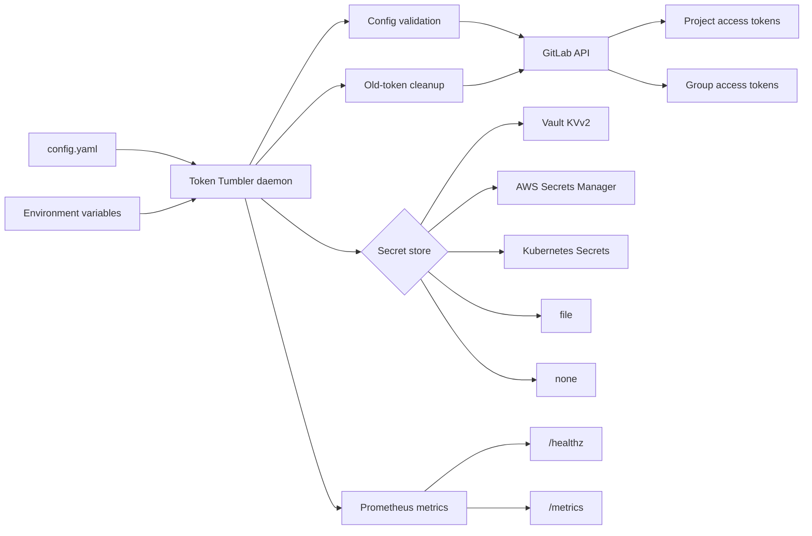

# Token Tumbler

[](https://github.com/Nabsku/token-tumbler/actions/workflows/ci.yml)
[](https://github.com/Nabsku/token-tumbler/releases)
[](./LICENSE)
[](./go.mod)

Token Tumbler is a small Go daemon for rotating GitLab project and group access tokens without burning the old token too early. It creates the replacement first, stores the new value, and only then cleans up stale tokens.

It works with GitLab project and group access tokens. New token values can go to Vault KVv2, AWS Secrets Manager, Kubernetes Secrets, a local file, or nowhere at all if another process handles persistence.

## Why use it?

- Rotates GitLab project and group access tokens on a schedule.
- Fails closed: if the new token cannot be stored, old tokens stay alive.
- Writes to Vault KVv2, AWS Secrets Manager, Kubernetes Secrets, a local file, or `none`.
- Preserves unrelated keys when it updates Vault or Kubernetes secrets.
- Manages project and group targets from one YAML file.
- Keeps the newest token, then removes stale prefixed tokens after the grace period.
- Exposes Prometheus metrics and `/healthz`.
- Runs as a daemon with graceful shutdown.
- Has E2E tests backed by Testcontainers GitLab and Vault.

## Architecture



See [docs/architecture.md](docs/architecture.md) for the rotation flow and the safety rules.

## Quick start

Create `config.yaml` from the example:

```sh
cp config.example.yaml config.yaml
```

Then edit the targets and secret store paths for your environment:

```yaml
prefix: tt-
repositories:
  - repoName: group/example-project
    name: deploy
    permissions:
      - read_repository
    accessLevel: 20 # Reporter
    rotationThreshold: 3d
    lifetime: 5d
    gracePeriod: 2d
    secretStore: vault
    vaultMount: kv
    vaultPath: teams/example/project
    vaultKey: gitlab_token
```

Run the daemon:

```sh
export GITLAB_URL="https://gitlab.example.com"
export GITLAB_TOKEN="glpat-..."

# Optional; defaults to 5m. Uses Go duration syntax, for example 30s, 5m, 1h.
export TOKEN_TUMBLER_INTERVAL="5m"

# Vault AppRole (default auth method)
export VAULT_ADDR="https://vault.example.com"
export APPROLE_ID="..."
export APPROLE_SECRET="..."

go run .
```

Other Vault auth methods:

```sh
# Direct token auth
export VAULT_TOKEN="hvs.XXXX"

# Kubernetes auth (reads service account token automatically)
export VAULT_K8S_TOKEN_PATH="/var/run/secrets/..."  # optional

# AWS IAM auth (uses standard AWS credential chain)
# No extra env vars needed; ensure AWS credentials are available
```

## Install and deploy

Token Tumbler reads `config.yaml` from the current working directory. The published container image expects it at `/config.yaml`.

### Release binary

Download a platform archive from [GitHub Releases](https://github.com/Nabsku/token-tumbler/releases), then run the binary next to your `config.yaml`:

Verify the download first:

```sh
sha256sum -c checksums.txt --ignore-missing
```

Each release also includes SBOM archives generated by GoReleaser.

```sh
tar -xzf token-tumbler_<version>_<os>_<arch>.tar.gz
GITLAB_URL="https://gitlab.example.com" \
GITLAB_TOKEN="glpat-..." \
./token-tumbler

./token-tumbler --version
```

### Docker

```sh
docker run --rm \
  -v "$PWD/config.yaml:/config.yaml:ro" \
  -e GITLAB_URL="https://gitlab.example.com" \
  -e GITLAB_TOKEN="glpat-..." \
  -p 9090:9090 \
  ghcr.io/nabsku/token-tumbler:latest
```

### Docker Compose

```sh
cp config.example.yaml config.yaml
export GITLAB_URL="https://gitlab.example.com"
export GITLAB_TOKEN="glpat-..."
docker compose up
```

### Helm

Release tags publish the Helm chart as an OCI artifact in GitHub Container Registry. The chart source lives in [`helm/token-tumbler`](helm/token-tumbler).

Create a small values file, then install the published chart:

```yaml
# values.yaml
env:
  gitlabUrl: https://gitlab.example.com
  gitlabToken: glpat-...

config:
  prefix: tt-
  repositories:
    - repoName: group/example-project
      name: deploy
      permissions:
        - read_repository
      accessLevel: 20
      rotationThreshold: 3d
      lifetime: 5d
      gracePeriod: 2d
      secretStore: vault
      vaultMount: kv
      vaultPath: teams/example/project
      vaultKey: gitlab_token
```

```sh
helm install token-tumbler oci://ghcr.io/nabsku/charts/token-tumbler \
  --version <version> \
  -f values.yaml
```

Or install from a local checkout:

```sh
helm install token-tumbler ./helm/token-tumbler \
  -f values.yaml
```

For production, use `existingSecret` or an external secrets operator instead of passing secrets with `--set`. Keep `replicaCount: 1` unless `leaderElection.enabled=true`. The chart refuses to render unsafe multi-replica settings without leader election. See the [Helm chart README](helm/token-tumbler/README.md).

## Environment variables

| Variable | Required | Description |
| --- | --- | --- |
| `GITLAB_URL` | Yes | GitLab base URL, for example `https://gitlab.example.com`. |
| `GITLAB_TOKEN` | Yes | GitLab token used to list, create, and revoke project/group access tokens. Grant only the minimum permissions needed for configured targets. |
| `TOKEN_TUMBLER_INTERVAL` | No | Polling interval. Defaults to `5m`. Uses Go duration syntax only, such as `30s`, `5m`, or `1h`. |
| `TOKEN_TUMBLER_METRICS_ADDR` | No | Metrics and health server bind address. Defaults to `:9090`. |
| `VAULT_ADDR` | Vault only | Vault server URL, for example `https://vault.example.com`. |
| `APPROLE_ID` | Vault AppRole only | Vault AppRole role ID. |
| `APPROLE_SECRET` | Vault AppRole only | Vault AppRole secret ID. |
| `VAULT_TOKEN` | Vault token auth only | Vault token for `vaultAuthMethod: token`. |
| `VAULT_K8S_TOKEN_PATH` | No | Optional service-account token path override for Vault Kubernetes auth. |
| `TOKEN_TUMBLER_LEADER_ELECTION_ENABLED` | No | Enables Kubernetes leader election with Lease objects. Defaults to `false`. |
| `TOKEN_TUMBLER_LEADER_ELECTION_NAMESPACE` | Leader election only | Namespace containing the Lease. The Helm chart sets this from the pod namespace. |
| `TOKEN_TUMBLER_LEADER_ELECTION_LEASE_NAME` | No | Lease name. Defaults to `token-tumbler`; the Helm chart uses the release fullname. |
| `TOKEN_TUMBLER_LEADER_ELECTION_IDENTITY` | No | Unique pod identity. Defaults to hostname; the Helm chart uses pod name. |
| `TOKEN_TUMBLER_LEADER_ELECTION_LEASE_DURATION` | No | Lease duration. Defaults to `15s`. |
| `TOKEN_TUMBLER_LEADER_ELECTION_RENEW_DEADLINE` | No | Lease renew deadline. Defaults to `10s`. |
| `TOKEN_TUMBLER_LEADER_ELECTION_RETRY_PERIOD` | No | Lease retry period. Defaults to `2s`. |

Config durations such as `rotationThreshold`, `lifetime`, and `gracePeriod` support `s`, `m`, `h`, `d`, `w`, and `M`. `TOKEN_TUMBLER_INTERVAL` is different because it uses Go's `time.ParseDuration`; use `s`, `m`, or `h` there.

## Documentation

- [Configuration](docs/configuration.md) - config fields, validation rules, and examples
- [Permissions and token keys](docs/permissions.md) - what `GITLAB_TOKEN` needs, what generated tokens get, and how to check access with `glab`
- [Secret stores](docs/secret-stores.md) - Vault, AWS, Kubernetes, file store, and `none`
- [Monitoring](docs/monitoring.md) - Prometheus metrics, PromQL queries, and alert examples
- [Development](docs/development.md) - tests, the E2E suite, Makefile targets, and contributing notes
- [Helm chart](helm/token-tumbler/README.md) - Kubernetes install, values, metrics, and replica safety

## Token naming

Generated tokens use this shape:

```text
<prefix><name>-<RFC3339 timestamp>
```

For example:

```text
tt-deploy-2026-04-29T12:00:00Z
```

`prefix` is normalized. `tt` and `tt-` belong to the same prefix family for matching and cleanup.

## License

Token Tumbler is released under the [MIT License](./LICENSE).

## Getting help

Use [GitHub Issues](https://github.com/Nabsku/token-tumbler/issues) for bug reports and feature requests. Report security issues privately; see [SECURITY.md](SECURITY.md).
