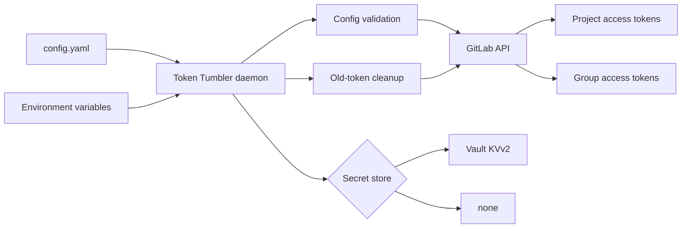
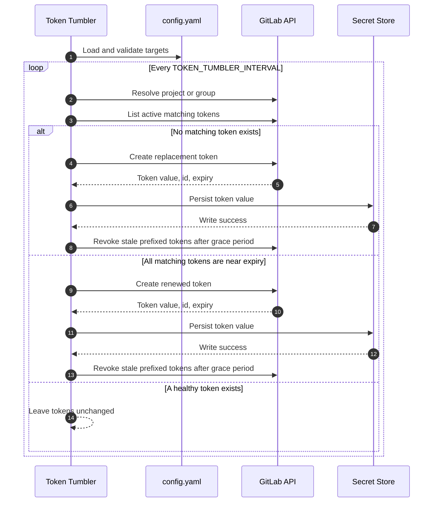
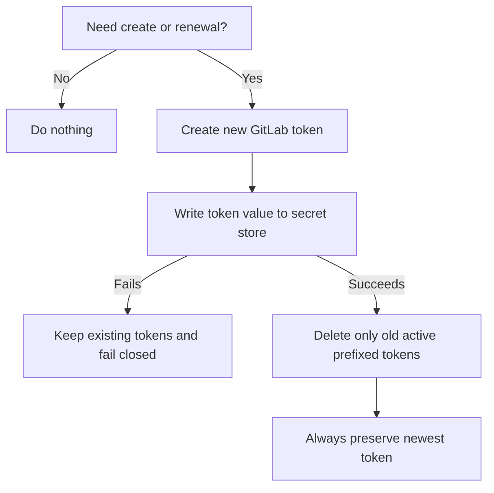
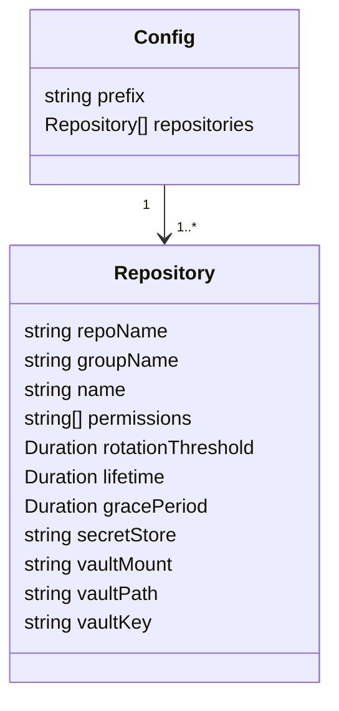

# Token Tumbler

Token Tumbler is a small Go daemon for safely rotating GitLab project and group access tokens. It creates replacement tokens before expiry, writes newly-created token values to a configured secret store, and only revokes older tokens after persistence succeeds.

It currently supports GitLab project/group access tokens and Vault KVv2 persistence.

## Why Token Tumbler?

- **Automated rotation** for GitLab project and group access tokens
- **Fail-closed secret handling** so token cleanup does not happen unless the new secret is safely stored
- **Vault KVv2 support** with AppRole authentication and merge-friendly writes
- **Project and group targets** from one declarative YAML config
- **Grace-period cleanup** to keep the newest token alive while retiring stale tokens
- **Daemon mode** with a configurable polling interval and graceful shutdown
- **E2E coverage** with Testcontainers-backed GitLab and Vault

## Architecture



## Rotation flow



## Safety model



Token Tumbler is deliberately conservative:

- Generated GitLab token values are only available at creation time, so the secret write must succeed before old tokens are revoked.
- Unsupported or missing secret stores fail closed.
- Cleanup only revokes prefixed, active, non-revoked tokens older than the configured grace period.
- The newest matching token is never revoked.
- Tokens with missing creation timestamps are never selected as the newest cleanup candidate.

## Requirements

- Go 1.25 or newer
- A GitLab token with permission to list, create, and revoke project/group access tokens
- Vault AppRole credentials when any entry uses `secretStore: vault`
- Docker for the optional Testcontainers E2E suite

## Quick start

Create `config.yaml`:

```yaml
prefix: tt-
repositories:
  - repoName: group/example-project
    name: deploy
    permissions:
      - api
    rotationThreshold: 3d
    lifetime: 5d
    gracePeriod: 2d
    secretStore: vault
    vaultMount: kv
    vaultPath: teams/example/project
    vaultKey: gitlab_token
```

Run the daemon:

```sh
export GITLAB_URL="https://gitlab.example.com"
export GITLAB_TOKEN="glpat-..."

# Optional; defaults to 5m. Uses Go duration syntax, for example 30s, 5m, 1h.
export TOKEN_TUMBLER_INTERVAL="5m"

# Only needed when at least one config entry uses secretStore: vault.
export APPROLE_ID="..."
export APPROLE_SECRET="..."

go run .
```

## Configuration



### Top-level fields

| Field | Required | Description |
| --- | --- | --- |
| `prefix` | Yes | Prefix for generated GitLab token names. Allowed characters: letters, numbers, `-`, `_`. |
| `repositories` | Yes | Non-empty list of project or group token targets. |

### Repository fields

Each entry must define exactly one target:

| Field | Required | Description |
| --- | --- | --- |
| `repoName` | One of `repoName` or `groupName` | GitLab project path or ID. |
| `groupName` | One of `repoName` or `groupName` | GitLab group path or ID. |
| `name` | Yes | Logical token name used in generated GitLab token names. |
| `permissions` | Yes | GitLab token scopes, such as `api`. |
| `rotationThreshold` | Yes | How soon before expiry a token should be renewed. |
| `lifetime` | Yes | Maximum lifetime for newly-created tokens. Must be greater than `rotationThreshold`. |
| `gracePeriod` | Yes | How long to keep older tokens after a newer token exists. May be `0`. |
| `secretStore` | Yes | `vault` or `none`. Use `none` only for intentional no-persistence runs. |
| `vaultMount` | For Vault | Vault KVv2 mount name. |
| `vaultPath` | For Vault | Vault KVv2 secret path. |
| `vaultKey` | For Vault | Key inside the KVv2 secret data to write. |

Duration suffixes: `s`, `m`, `h`, `d`, `w`, `M` (`M` is 30 days).

### Secret stores

| Store | Description |
| --- | --- |
| `vault` | Writes the token value to Vault KVv2 using AppRole auth. Existing secret data is merged so unrelated keys are preserved. |
| `none` | Does not persist the generated token. Use only when external persistence is intentionally handled elsewhere. |

## Environment variables

| Variable | Required | Description |
| --- | --- | --- |
| `GITLAB_URL` | Yes | Base URL for GitLab. |
| `GITLAB_TOKEN` | Yes | Token with access-token management permissions. |
| `TOKEN_TUMBLER_INTERVAL` | No | Poll interval. Defaults to `5m`. |
| `APPROLE_ID` | When using Vault | Vault AppRole role id. |
| `APPROLE_SECRET` | When using Vault | Vault AppRole secret id. |
| `LOG_LEVEL` | No | Logger verbosity. |

## Token naming

Generated tokens use this shape:

```text
<prefix><name>-<RFC3339 timestamp>
```

For example:

```text
tt-deploy-2026-04-29T12:00:00Z
```

`prefix` is normalized, so `tt` and `tt-` behave as the same prefix family for matching and cleanup.

## Development

Fast validation:

```sh
go test ./...
go vet ./...
go build ./...
```

Or use the Makefile:

```sh
make check
```

Useful targets:

| Target | Description |
| --- | --- |
| `make fmt` | Format Go code. |
| `make test` | Run unit tests. |
| `make vet` | Run `go vet`. |
| `make build` | Build the project. |
| `make check` | Run formatting, tests, vet, build, and diff checks. |
| `make e2e` | Run the GitLab/Vault Testcontainers suite. |
| `make lint` | Run lint checks. |
| `make vuln` | Run vulnerability checks. |
| `make tidy` | Tidy Go modules. |

The slow E2E suite starts GitLab CE and Vault with Testcontainers:

```sh
go test -tags=e2e -v ./e2e -timeout 30m
```

Optional E2E image overrides:

- `TOKEN_TUMBLER_E2E_GITLAB_IMAGE`
- `TOKEN_TUMBLER_E2E_VAULT_IMAGE`

## Contributing

Contributions are welcome. Please run `make check` before opening a pull request and avoid committing real GitLab tokens, Vault AppRole credentials, or production config files.

See [CONTRIBUTING.md](./CONTRIBUTING.md).

## License

Token Tumbler is released under the [MIT License](./LICENSE).
