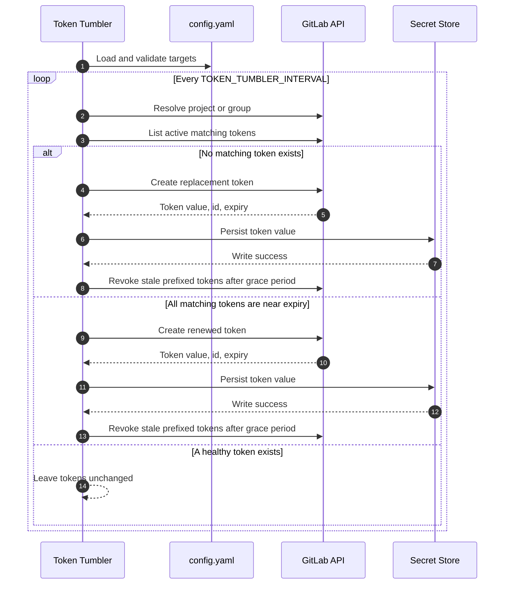
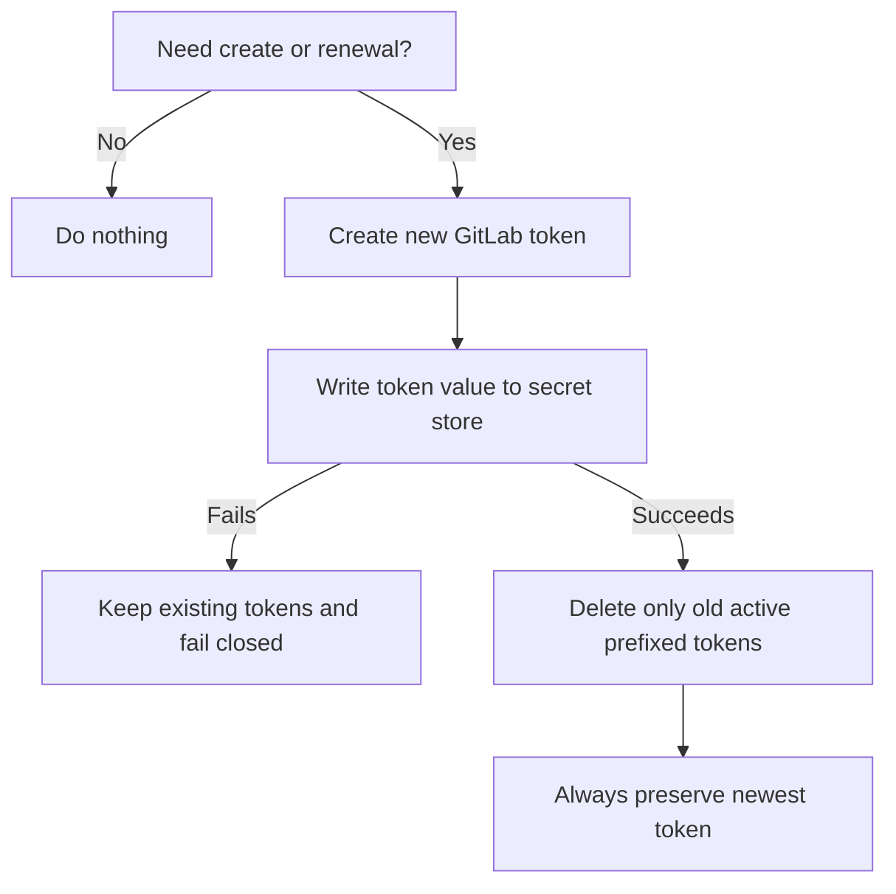

# Architecture

## Rotation flow

## Safety model

Token Tumbler is intentionally conservative:

- GitLab only shows a generated token value once, so the secret write must succeed before old tokens are revoked.
- Unsupported or missing secret stores fail closed.
- Cleanup only revokes prefixed, active, non-revoked tokens older than the configured grace period.
- The newest matching token is never revoked.
- Tokens with missing creation timestamps are never selected as the newest cleanup candidate.
- Duplicate config entries for the same prefix, target type, target, and token name are rejected.

## Observability

Token Tumbler exposes Prometheus metrics on a configurable HTTP endpoint. The default is `:9090`.

- `/metrics` - Prometheus metrics, including rotation counters, duration histograms, and secret store operation counters
- `/healthz` - health check endpoint

See [monitoring.md](monitoring.md) for metric names, PromQL queries, and alert examples.
